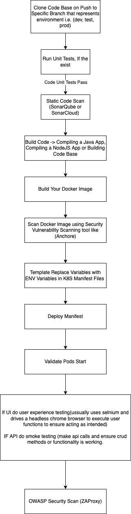

Github Actions Project: Creating an automation library for various devops functions that people can make use of instead of writing it themselves. 

consider: convert Libraries into github reusable actions.
 
--------------
## What is devops? (again)
Devops is the automation of the software delivery lifecycle. Automate anything you're doing more than once manually
Devops strives for as little downtime as possible. Instead of doing things in large swaths of changes, you do them in small increments that way you can verify that your changes don't break things. 
"Trust but verify" Any action you take, you validate the results happened as intended.

## Diagram of an ideal CI to Dev pipeline on push to branch: (GitOPS Pattern selects which branch {dev,prod})

1. Clone codebase
2. Run unit tests (might also happen after building)
3. Static Code Scan (Sonar, etc) to find errors or security vulns
4. Build Code (compile, whatever)
5. Build Docker Image
6. Scan Docker Image (eg Anchor)
7. Template K8 Manifest Files, replacing env variables
8. Deploy K8 Manifest
9. Validate Deployment (did pods start?)
10. Post Deployment Testing
	- If there's a UI, do user experience testing (eg selinium). 
	- If API, do smoke testing (make api calls and esnure crud methods of functionality are working)
11. OWASP Security Scan (eg ZAProxy) 
	a. a foundation that Scans for the top ten security risks. 

Sometimes apps will not be in a state to facilitate the pipeline all the times (ie no unit tests)

Template pipelines so they can be reused. Everything you do should be written in a way that it can be reused.

## Solving Problems within the DevOps Space
1. Watch a video or tutorial on the subject matter.
2. deploy manually, locally.
3. adapt to scale

Most things are possible to automate through code.

## Self-Healing Architecture
Validation or automation to restart malfunctioning services.
Kubernetes can accomplish this with liveliness and readiness probes. Scripted ones can be set up to remediate more difficult ones. 
Chaos testing involves deleting or restarting services to see how your infrastructure handles these. 
This is an ideal state but likely won't be implemented at most companies. 

"Anything done more than once manually should be set up to be done automatically"
When possible, don't present too many options because people can get confused. 

## How ingress controllers work in kubernetes 
ingress controllers are actually a nginx pod working as a reverse proxy. for nodetube the nginix config restricts the size of a chunk of a file you can send. 
